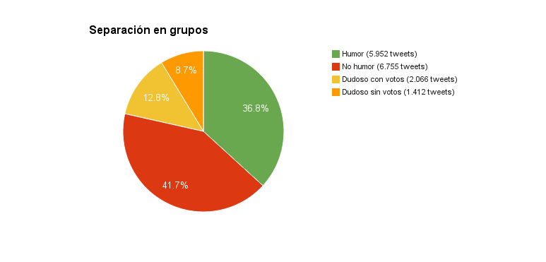

# pgHumor: Detección de humor en tweets en idioma español

Este proyecto de grado busca saber si un tweet escrito en idioma español se trata de humor o no, aplicando técnicas supervisadas de aprendizaje automático. Fue realizado por [Matías Cubero](https://github.com/matu1104) y [Santiago Castro](https://github.com/bryant1410), y supervisado por [Guillermo Moncecchi](https://github.com/gmonce) y Diego Garat. Por información más completa, ver [el informe final](InformeV3.4.pdf).

Queremos agradecer a Diego Serra e Ignacio Acuña, que realizaron su proyecto del curso [Computación de Alta Performance](https://www.fing.edu.uy/inco/cursos/hpc) basado en este trabajo, supervisado por Sergio Nesmachnow, con el fin de mejorar el rendimiento del clasificador a la hora de calcular los valores de las características. Se puede ver en [la etiqueta hpc-entrega](https://github.com/pln-fing-udelar/pghumor/tree/hpc-entrega). La continuación de su línea de trabajo está [en la rama hpc](https://github.com/pln-fing-udelar/pghumor/tree/hpc).

# Resumen

> — Ayer, al salir del trabajo atropellé a un unicornio.
>
> — No jodas, ¿tenés trabajo?

¿Qué hace gracioso a este tweet? ¿Qué es el humor? ¿Qué genera la risa? El proyecto intenta acercarse a eso. Existen teorías, pero ninguna logra ser completamente certera.

Se extrajeron 16.488 tweets de cuentas humorísticas y 22.875 de cuentas no humorísticas (noticias, frases filosóficas y curiosidades). Se realizó una [aplicación web](https://github.com/pln-fing-udelar/pghumor-clasificahumor) y una [aplicación Android](https://github.com/pln-fing-udelar/pghumor-clasificahumor-android) para que la gente nos dé su opinión de cuáles son humorísticos realmente. Se obtuvieron 33.531 votacinoes desde inicios del mes de setiembre de 2014 hasta finales de octubre del mismo año (¡gracias!). Resultó haber poco humor en las cuentas humorísticas:



Se contstruyó este clasificador en base a características que buscan informalidad, determinado formato, temas que generan tensión, entre otras cosas. Utiliza técnicas como SVM, kNN, árboles de decisión y Naïve Bayes. Se logra una precisión de 83,6% y recall de 68,9% sobre el corpus construido.

Se construyó también [una demo](https://github.com/pln-fing-udelar/pghumor-demo) para ilustrar los resultados obtenidos.

# Instalación

Las dependencias principales de este proyecto son:

* Python 2.7 (junto con varias bibliotecas; ver el código)
* MySQL
* Freeling (revisión 2588 del SVN)

# Configuración

Se deben cargar los dumps corpus.sql y chistesdotcom.sql

En el archivo `clasificador/config/environment.py` poner las credenciales de la API de Twitter y los datos para las bases de datos. Un ejemplo de este archivo es el siguiente:

```python
# coding=utf-8
from __future__ import absolute_import, division, print_function, unicode_literals

import os

# Twitter API credentials
os.environ['CONSUMER_KEY'] = '--CONSUMER KEY--'
os.environ['CONSUMER_SECRET'] = '--CONSUMER SECRET--'
os.environ['ACCESS_KEY'] = '--ACCESS KEY--'
os.environ['ACCESS_SECRET'] = '--ACCESS SECRET--'

os.environ['DB_HOST'] = 'localhost'
os.environ['DB_USER'] = 'pghumor'
os.environ['DB_PASS'] = '--PASSWORD--'
os.environ['DB_NAME'] = 'corpus'
os.environ['DB_NAME_CHISTES_DOT_COM'] = 'chistesdotcom'
```

Poner la variable de entorno a donde se encuentre el entorno de Freeling y dejarla puesta siempre:

```bash
FREELINGSHARE=/usr/local/share/freeling
echo "export FREELINGSHARE=$FREELINGSHARE" >> ~/.bashrc
```

# Ejecución

Levantar antes los servidores de Freeling (para poder calcular las características):

```bash
./freeling.sh start
```

Luego para correr:

```bash
clasificador/main.py
```

Para bajar los servidores de Freeling:

```bash
./freeling.sh stop
```

## Ayuda

```bash
clasificador/main.py --help
```

# Tests

```bash
./tests.sh
```
